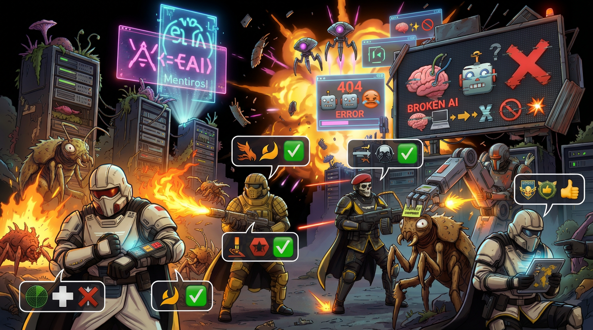

# Promptdivers



## *Democracia administrada para el desarrollo asistido por IA*

> La humanidad no salió de la deuda técnica, los specs borrosos y el scope creep  
> para rendirse ahora. **Luchamos. Por la democracia.**

**Español** · [English — README.md](README.md)

---

## Qué es esto: un **framework** + **skills** (no un “producto agente” único)

Promptdivers es un **framework portable**: doctrina en Markdown (escuadras, protocolos, estratagemas), **skills de IDE** que enseñan al asistente *cuándo* cargar *qué*, y plantillas (`AGENTS.md`, logs, misiones). El **asistente de IA en tu IDE** (Claude Code, Cursor, etc.) es el motor de ejecución; **este repositorio** es el manual de campaña.

Inspirado en *Helldivers 2*: escuadras, estratagemas, tres frentes, escalada — aplicado al trabajo de código **asistido** en proyectos reales.

**Skills incluidos (tres — bastan para el ciclo completo):** `promptdivers-orchestrator` (ruteo + pistas multi-dominio + flota de modelos), `promptdivers-tactical-signals` (pings), `promptdivers-pelican` (debrief / puntuación de handoff). Skills **opcionales** delgados (solo handoff, carga perezosa de escuadras, solo escalada) están **documentados, no obligatorios** — ver [docs/SKILLS_AND_EXTENSIONS.md](docs/SKILLS_AND_EXTENSIONS.md).

---

## Los tres frentes

| Frente | Eco Helldivers | En software |
|--------|----------------|-------------|
| **Termínidos** | Enjambres de bichos | Defectos, regresiones, tests flaky, incendios en prod |
| **Autómatas** | Máquinas rígidas | Scripts y pipelines frágiles que nadie entiende |
| **Iluminados** | Amenaza opaca | IA sin gobernanza: salida sin revisión, permisos flojos, “agentes sombra” |

**Ganar** = soluciones duraderas: features claras, automatización mantenible y flujos de IA con reglas y revisión. Detalle: [docs/factions-and-objectives.md](docs/factions-and-objectives.md).

---

## Las cuatro escuadras

| Escuadrón | Misión | Despliega cuando |
|-----------|--------|------------------|
| **A — Avance** | Reconocimiento y base | Repo nuevo, terreno desconocido, sin brief |
| **B — Artillería** | Cambio grande coordinado | Refactors, migraciones, muchos archivos |
| **C — Quirúrgica** | Un tiro, un objetivo | Bug pequeño, feature acotada, hotfix |
| **D — Defensa** | Mantener la línea | Revisión de PR, pre-release, higiene de sesión |

**Crisis / di `TOTAL DEMOCRACY`** → todas las escuadras, máxima prioridad.

---

## Instalación rápida

```bash
git clone https://github.com/tu-org/promptdivers.git
cd promptdivers
./install.sh
```

Detecta IDE (Claude Code, Cursor, Windsurf) e instala los **tres skills** en tu carpeta global de skills.

**Arrancar un proyecto a la vez:**

```bash
./install.sh --project /ruta/a/tu-proyecto
```

Copia `AGENTS.md`, `CLAUDE.md`, `QUICK_REFERENCE.md` y plantilla de `PROJECT_LOG.md`.

Instalación manual y por IDE: [docs/MULTI_AGENT_SETUP.md](docs/MULTI_AGENT_SETUP.md).

---

## Tres capas (cómo encaja todo)

1. **Proyecto:** `AGENTS.md` (contrato), `PROJECT_LOG.md` (memoria de sesión).  
2. **Skills del IDE:** tres carpetas con `SKILL.md` — el IDE las carga cuando encaja la descripción.  
3. **El pack (este repo):** `squads/`, `protocols/`, `stratagems/`, `docs/` — la doctrina completa a la que apuntan los skills.

Los skills **no** reemplazan al pack: son el **gancho**; el pack es la **biblioteca**.

---

## ¿Faltan más skills?

Para el flujo estándar (**rutear → trabajar → debrief / handoff**), **no**: los tres skills cubren orquestación, señales y cierre de misión. Si quieres más granularidad (solo handoff, solo escalada, lazy-load de una escuadrá), [docs/SKILLS_AND_EXTENSIONS.md](docs/SKILLS_AND_EXTENSIONS.md) describe extensiones opcionales — puedes añadirlas tú o ignorarlas.

---

## Primera misión — 5 minutos

1. `./install.sh --project ~/mi-proyecto`  
2. Edita `AGENTS.md` (stack, permisos, rutas críticas).  
3. En el IDE: *“Necesito entender este codebase. Ejecuta el Escuadrón A.”*  
4. `status` → SITREP.  
5. `debrief` → cierre con objetivos y bloque de handoff.

**El ciclo:** antes de elegir escuadra y nave, el asistente lee el mapa galáctico (`GALACTIC_WAR_MAP.md`) para ver los frentes activos y el sector más amenazado — igual que revisar el planeta antes de dropear. El trabajo puede revelar misiones secundarias y terciarias; se encolan en `missions_queued` sin expandir el alcance activo. El **framework** (skills + pack) define el ruteo, las señales y la memoria; el **asistente** lo sigue. Tú declaras la misión.

Onboarding ampliado (en inglés, universal): [FIRST_MISSION.md](FIRST_MISSION.md).

---

## Palabras clave humanas

| Dices | Qué pasa |
|-------|----------|
| `status` | SITREP |
| `save` | Actualiza log + handoff |
| `debrief` / `extract` | Pelican: puntuar objetivos, `PROJECT_LOG` |
| `handoff` | JSON estructurado para otra sesión |
| `escalate` | Protocolo de escalada con evidencia |
| `TOTAL DEMOCRACY` | Todas las escuadras |
| `scope check` | Dentro / fuera de alcance |
| `debt` | Deuda técnica rastreada |
| `abort` | Parar y reportar |

Lista completa en [README.md](README.md) y [QUICK_REFERENCE.md](QUICK_REFERENCE.md).

---

## Documentos clave (inglés canónico)

| Ruta | Uso |
|------|-----|
| [QUICK_REFERENCE.md](QUICK_REFERENCE.md) | Chuleta de una página |
| [docs/model-fleet.md](docs/model-fleet.md) | Flota de modelos (naves) y ruteo |
| [docs/super-earth-operating-model.md](docs/super-earth-operating-model.md) | Arquetipos de misión |
| [docs/agent-ecosystem-integration.md](docs/agent-ecosystem-integration.md) | Promptdivers + skills externos |
| [protocols/mission-debrief.md](protocols/mission-debrief.md) | Debrief / Pelican |
| [missions/README.md](missions/README.md) | Tutoriales guiados (p. ej. landing / “propaganda” web → [tutorial-08](missions/tutorial-08-propaganda-web.md)) |

---

## Contribuir y licencia

[CONTRIBUTING.md](CONTRIBUTING.md) · Licencia MIT. **Seguridad:** [SECURITY.md](SECURITY.md) (canal privado; no uses issues públicos para vulnerabilidades no divulgadas).

---

## Marcas registradas

*Helldivers 2* y nombres relacionados son marcas de sus titulares. Promptdivers es una metáfora independiente de estilo fan para flujo de ingeniería — sin afiliación ni respaldo de los editores del juego.

---

*Promptdivers — democracia administrada, un commit a la vez.*  
**POR LA DEMOCRACIA.**
